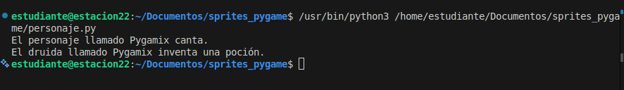
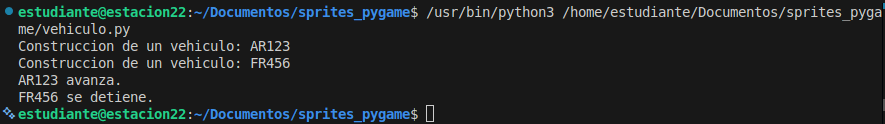
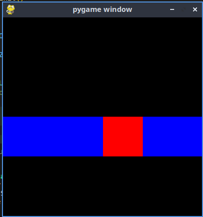

## Resumen: Sprites, grupos y POO en Pygame

### 1. ¿Qué es un sprite en Pygame?

Un **sprite** es un objeto gráfico que combina:

* Una **posición** en la pantalla.
* Una **imagen o representación gráfica**.
* Un conjunto de **propiedades** (nombre, movimiento, estado, etc.).

En los videojuegos, casi todo puede ser un sprite:

* personajes,
* enemigos,
* objetos,
* paredes,
* balones,
* armas, etc.

Los sprites se actualizan continuamente dentro del bucle del juego.

---

## 2. ¿Qué es un grupo (Group)?

Un **grupo** es una colección de sprites.

Sirve para:

* organizar objetos similares,
* actualizar muchos sprites al mismo tiempo,
* dibujarlos juntos,
* aplicar acciones colectivas.

Ejemplos:

* todos los enemigos,
* todas las balas,
* todos los objetos decorativos.

Gracias a los grupos, el código es más limpio y eficiente.

---

## 3. Gestión de colisiones

Las **colisiones** ocurren cuando dos objetos gráficos se tocan.

Ejemplos:

* un balón toca el suelo,
* un personaje recoge un objeto,
* un enemigo golpea al héroe,
* un cohete llega al borde de la pantalla.

Pygame facilita esta gestión mediante sprites y grupos.

---

# Programación Orientada a Objetos (POO)

## 4. Conceptos principales

### Clase

Es el modelo o plantilla de un objeto.

Ejemplo:

* clase `Vehiculo`

### Atributos

Son las propiedades del objeto.

Ejemplo:

* color,
* matrícula,
* número de puertas.

### Métodos

Son las acciones que puede realizar el objeto.

Ejemplo:

* avanzar(),
* detenerse().

### Instancia

Es un objeto creado a partir de una clase.

Ejemplo:

* un carro rojo específico.

---

## 5. Herencia

La **herencia** permite que una clase hija obtenga atributos y métodos de una clase padre.

Ejemplo:

* `Druida` hereda de `Personaje`.

Así:

* el druida puede cantar (heredado),
* y también crear pociones (propio).

---

# Palabras clave importantes en Python

## `self`

Representa la instancia actual del objeto.

Permite acceder a:

* atributos,
* métodos propios del objeto.

---

## `class`

Se usa para definir una clase.

---

## `def`

Se usa para crear funciones o métodos.

---

## `__init__`

Es el inicializador de la clase.

Sirve para:

* crear objetos,
* asignar valores iniciales.

---

# Sprites en Pygame

## 6. Clase Sprite

Pygame tiene la clase:

```python
pygame.sprite.Sprite
```

Para crear un sprite propio, se hereda de ella:

```python
class CUADRADO(pygame.sprite.Sprite):
```

---

## 7. Elementos importantes del sprite

### `image`

Representa la imagen o superficie del sprite.

### `rect`

Define:

* posición,
* tamaño,
* colisiones.

### `update()`

Método que se ejecuta automáticamente en cada iteración del juego.

Sirve para:

* mover objetos,
* actualizar estados,
* controlar colisiones.

---

# Uso de grupos

## Crear grupo

```python
all_sprites = pygame.sprite.Group()
```

---

## Agregar sprite

```python
all_sprites.add(cuadrado)
```

---

## Actualizar sprites

```python
all_sprites.update()
```

Llama automáticamente al método `update()` de cada sprite.

---

## Dibujar sprites

```python
all_sprites.draw(screen)
```

---

## Limpiar pantalla

```python
all_sprites.clear(screen, background)
```

---

# Idea principal del tema

Pygame utiliza:

* **sprites** para representar objetos gráficos,
* **grupos** para organizarlos y controlarlos fácilmente.

Esto:

* simplifica el desarrollo,
* mejora la organización del código,
* facilita animaciones y colisiones,
* hace más eficiente el bucle del juego.


##### fotos ilustrativas de como funcionan

1. personaje.py:



2. vehiculo.py:



3. cuadrado.py:



el de la bici.py no cuenta de cierta manera ya que es un sonido y implementarlo en una imagen ilustrativa como que es un poco imposible. VIVA AVERNUS

